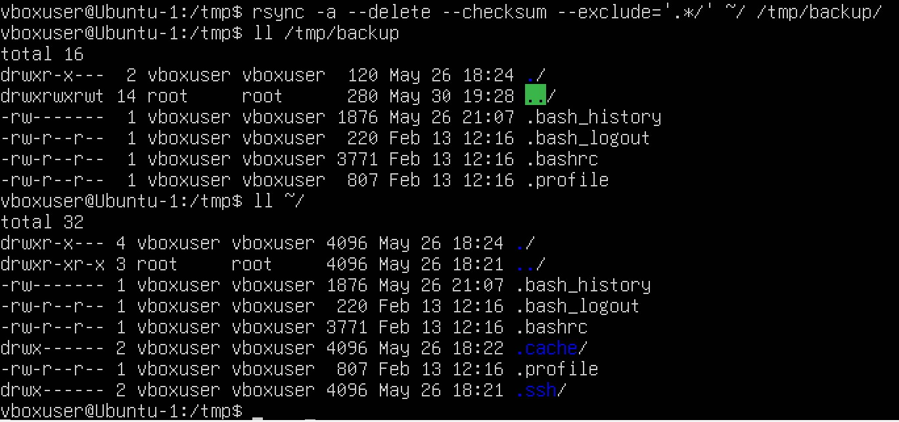
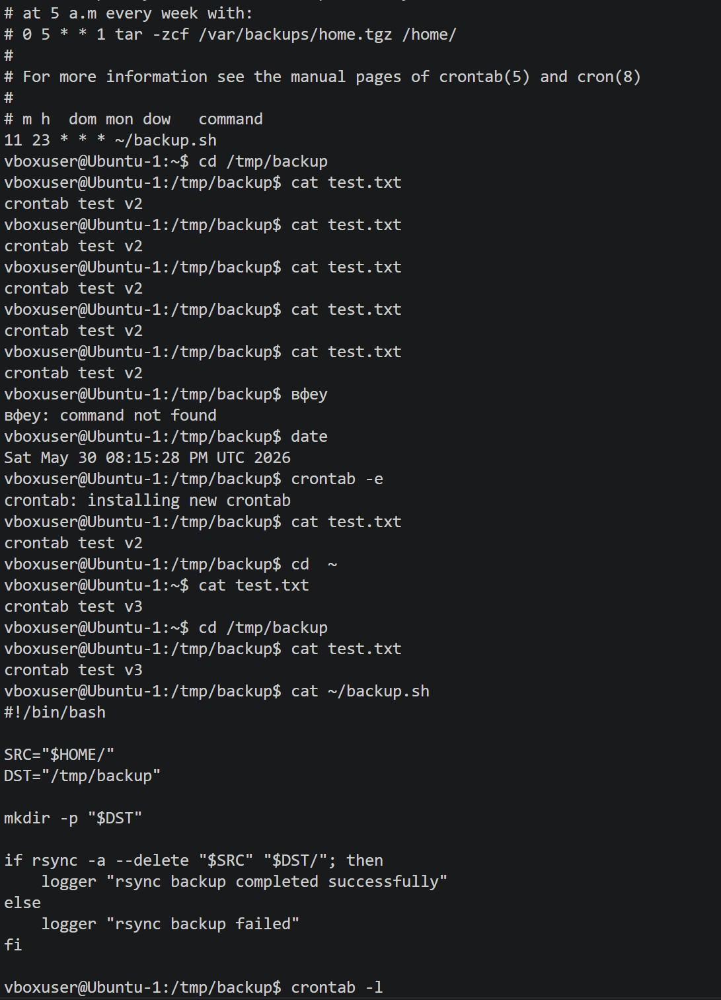

# Домашнее задание к занятию "Резервное копирование" - Горелик Борис

### Задание 1

Составьте команду rsync, которая позволяет создавать зеркальную копию домашней директории пользователя в директорию /tmp/backup
Необходимо исключить из синхронизации все директории, начинающиеся с точки (скрытые)
Необходимо сделать так, чтобы rsync подсчитывал хэш-суммы для всех файлов, даже если их время модификации и размер идентичны в источнике и приемнике.
В ЛК отправьте скриншот с командой и результатом ее выполнения

---

### Задание 2

Написать скрипт и настроить задачу на регулярное резервное копирование домашней директории пользователя с помощью rsync и cron.
Резервная копия должна быть полностью зеркальной
Резервная копия должна создаваться раз в день, в системном логе должна появляться запись об успешном или неуспешном выполнении операции
Резервная копия размещается локально, в директории /tmp/backup
В ЛК отправьте файл crontab и скриншот с результатом работы утилиты.

---

